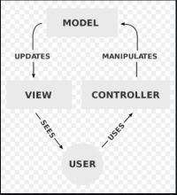
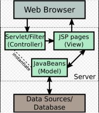
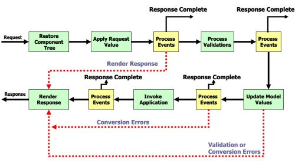

# jsf-campus

### Model View Controller (MVC)
Il `Model View Controller` e' un'architettura che separa la logica di presentazione, i dati e la logica di business.
* `Model` rappresenta il modello dati.
* `View` rappresenta la parte grafica dell'applicazione e l'interazione con il cliente.
* `Controller` rappresenta la logica dell'applicazione. Esso funge da tramite del `Model` e della `View`.

 

### Java Server Faces (JSF)
`JSF` e' un framework Java che ti permette di creare applicazioni Web seguendo l'architettura `MVC`. Si puoì dire che JSF implementa l'approccio MVC.

JSF mette a disposizione una serie di `@Annotations` per poter sviluppare l'applicazione.
- `@ManagedBean`
- `@FacetConverter`
- `@FacetValidator`
- etc.


### Dichiarazione del managed bean

Quando utilizzi l'annotazione `@ManagedBean` in una classe java stai dicendo al JSF di registrare questa classe nel suo `context`. 

```
@ManagedBean("beanController")
@SessionScoped
public class BeanController {
	//codice 
}
```
Il nome del bean nel contesto jsf sara' `beanController`. Se non si assegna nessun nome, per deafult jsf mette il nome della classe con la prima lettera in minuscolo.
Il ciclo di vita del bean può essere di 4 tipi:
* `@ApplicationScoped`, il bean viene creato una volta per la durata dell'applicazione.
* `@SessionScoped`, il bean viene creato una volta per la durata della sessione.
* `@ViewScoped`, il bean viene creato una volta per la durata della view.
* `@RequestScoped`, il bean viene creato una volta per la durata della request.

### Ciclo di vita di un JSF

Il ciclo di vita definisce il processo mediante il quale una richiesta viene gestita da una applicazione JSF dal momento in cui viene presa in carico dal controller fino alla generazione di una risposta al client.

Ogni pagina di una applicazione JSF viene rappresentata da un albero di componenti che corrispondono ai vari elementi dell‘interfaccia grafica `component tree`.

Le fasi del ciclo, dopo l'invio della `request` sono le seguenti:
* `Restore Component Tree`<br> 
In questa fase il framework acquisisce il `component-tree` della pagina richiesta se non è la prima request alla stessa, altrimenti ne crea uno nuovo nel caso di prima request.<br> 
Se la request non possiede dati (i dati in una request `HTTP` vengono manipolati sottoforma di `stringhe`) il framework redirige il flusso alla fase di RenderResponse.
* `Apply Request Value` <br>
In questa fase il framework memorizza i dati associati alla request nei componenti associati ai vari elementi della pagina. <br>
Al termine di questa fase tutti i componenti sono aggiornati con i dati acquisiti dalla richiesta pervenuta.
* `Process Validations`<br> 
In questa fase a tutti i componenti dell‘albero che rappresenta la pagina in elaborazione viene richiesto di verificare che i valori presenti nella richiesta e memorizzati nella fase precedente sono validi quindi accettabili.<br> 
I dati vengono convertiti da stringhe al formato usato nel Model.<br> 
Se i valori sono validi il framework passa alla fase successiva altrimenti salta alla fase RenderResponse con i relativi messaggi di errore.
* `Update Model Values`<br> 
In questa fase avviene l'aggiornamento degli attributi associati ai vari componenti della vista presenti nel Model, tramite il popolamento degli stessi, con i dati fin qui validati.<br> 
Per interfacciare la View con il Model si usano dei `backing-bean`, che sono dei `JavaBean`, classi scritte in linguaggio `Java`, e generalmente contengono proprietà  che vengono valorizzate con i valori immessi dall‘utente nella vista dell‘applicazione e metodi che effettuano elaborazioni in risposta ad eventi.
* `Invoke Application` <br> 
In JSF quando un utente interagisce con un elemento della vista, un bottone o un link, vengono generati degli eventi, `action events`, i quali sono gestiti da listener, `action listener`.<br>
In questa fase il framework notifica gli action events a tutti i listener registrati, quindi vengono eseguiti gli `action methods` dei backing-bean della vista e quindi viene eseguita la logica corrispondente all‘azione effettuata dall‘utente sull‘interfaccia.
* `Render Response` <br>
Ultima fase del ciclo si occupa di memorizzare lo stato della vista che si sta elaborando e di generare la risposta al client.



### See
* [JSF Overview](src/main/doc/JSFIntro.pdf)
* [JSF Practical tutorial](src/main/doc/jsf_tutorial.pdf)
